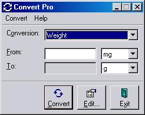



## Convert Pro

### Description

Converts numbers from different units, eg metres to feet or degrees C to F. You can fully customize the code by editing/adding conversions and units.

The code itself is split into a back-end activeX dll that does the conversions, and a front-end interface. You can just use the back-end in your own projects for simple conversion!
 
### More Info
 
The value you have.

Read the readme.txt file in the zip for detail explaination. :-)

The converted value

             |
---                |---
**Submitted On**   |2000-10-11 17:30:30
**By**             |[Andrew Davey](https://github.com/Planet-Source-Code/PSCIndex/blob/master/ByAuthor/andrew-davey.md)
**Level**          |Advanced
**User Rating**    |3.3 (10 globes from 3 users)
**Compatibility**  |VB 6\.0
**Category**       |[Complete Applications](https://github.com/Planet-Source-Code/PSCIndex/blob/master/ByCategory/complete-applications__1-27.md)
**World**          |[Visual Basic](https://github.com/Planet-Source-Code/PSCIndex/blob/master/ByWorld/visual-basic.md)
**Archive File**   |[CODE\_UPLOAD1066710152000\.zip](https://github.com/Planet-Source-Code/andrew-davey-convert-pro__1-12065/archive/master.zip)

